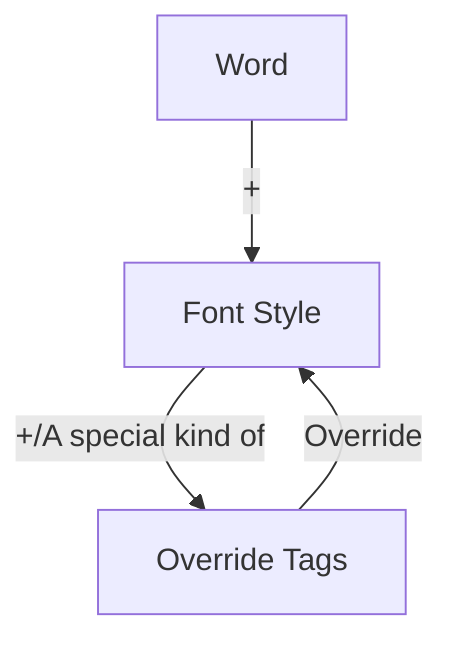

# Aegisub Override Tags | Aegisub特效标签

## General 综述

### Preface 前言

It's a personal edition of Aegisub Override Tags Documentation. This document is good for **amateur** and **experienced**, and also detailed enough for novice to build a comprehension to the tags. Also, if you are an expert, the documents will also have a great help in understanding **why** it is so. So you won't have to spend so many time in debugging or reviewing the official documents everytime you use them.

Before you read, I'd like to state that the tag is highly associated with computer programming, though it's possible to be used without any programming skills.

- If you know nothing about programming and are a completely freshman, I highly recommand you to read [Official Documents](http://docs.aegisub.org/3.2/Main_Page/) and watch some [Tutorial videoes]() first.
- If you are a programmer or **have some basic knowlege in programming**, it will be easy for you to understand. So you only need to take a quick look of this document and use the [API]() once you need to have a look-up.
- If you are an **experienced subtitle producer** with little understanding in programming area, congratulations! This tutorial is tailored for you! Or if you are already an **expert** in Aegisub and want to sharpen your comprehension, this tutorial will also leave a benefit for you.

In conclusion, this documentation is customized for those who **have basic knowledge of Aegisub**, and interest in **learning more about tags and related programming theories**.

---

这是一篇个人版Aegisub特效标签文档。本文档适合于**爱好者**和**熟练使用者**阅读，并且内含了大量详细说明以供初学者对标签有一个更好的理解。当然，如果你已经非常熟悉Aegisub，这篇文档也能帮你理解(一些写法和现象)**为什么**会是这样。这样你在每次使用时就不必花费大量时间来进行调试和翻阅文档。

在阅读之前，我想先声明特效标签与编程是密切相关的，即便不需要编程基础也能正常使用。

- 如果你是一个完全不了解编程(并且还不太会使用Aegisub)的纯萌新，我强烈推荐你先去阅读[官方文档]()并且观看一些[教学视频]()。
- 如果你是一位程序工程师或者**有一定的编程知识**，那么你会非常快地理解本文档内容。因此你可以快速阅读本文档，之后查阅[API文档]()即可。
- 如果你是一位使用Aegisub非常熟练的**轴Man**，但你对于相关编程知识不甚了解。那么恭喜你！本文档就是为你量身定做的！或者如果你已经是一位**老轴师**并想加深自己对Aegisub的理解，这篇文档一样对你会有帮助。

总之，本文档的适合**对Aegisub有基本了解**，并**对特效标签及相关编程知识感兴趣**的使用者阅读。

### What is "Override"? 何为"重载"?

Override is a programming terminology, which originally means the sub class rewrite the function in the superclass or interface, so that every instance(object) under the sub class, would prefer to excute the override funtion, instead of the original function declared in the super class. Actually, you don't have to know it so well before your journey in using override tags. In fact, to be simple but not accurate, we can state that each style of every subtitle lines (especailly refers to dialogue), have a 3-layer struture of its presentation in vision.

### Break 空白

### Line Autobreaking Style 自动换行模式

### Interpretation 名词解释

#### Color Notation 颜色注记

A color notation is used to present a RGB color, and in Aegisub, it should be written as `&H<6-digits_color_code>&`. For the 6-digit's code, it is a standard code to discribe any of the RGB color, which is widely used in web, Photoshop and etc. It is in a format of `RRGGBB` which has **a hexical number used for a 8-bit color discription**.

In most case, color notation is capital insensitive, which means `FFACDB`and`ffacdb`are actually the same.

> Note: Though unstandard color code still work, such as `&HFF0000&`(Red) could be written as `&FF0000&`,`FF0000`,`Hff`and even`ff`. 
>
> A pattern for Aegisub's interpretor is that:
>
> - **Left-Association**
>
>   In another word, it will read from left to right, so left code share higher priority than the right. So that's why `FF` equals to `FF0000` instead of `0000FF`. It's the same for inline key words and override tags.
>
> - **1-Parameter Inclusity**
>
>   Although it's hard for those programming freshman to comprehend, it's neccessary to tell somthing about [parameter](#Parameter-参数) so that it will be easier for amateurs to remember those **format**. The law is that every tag has only one parameter, or parameter tuple(list). So for those tags that need multi-variables, we need a `()` to make them together as a tuple, otherwise without it.

#### Library 库

#### Fx Scope 效果作用域

#### Parameter 参数

#### Notation 注记形式

## Elements 元素

### Size 大小

#### Font Size 字体大小

| Code               | \fs<font_size>                                               |
| ------------------ | ------------------------------------------------------------ |
| Discription        | Inline modifier of font's dot size.                          |
| Fx Scope           | Syllable                                                     |
| Library Affiliated | VSFilter                                                     |
| Note               | The dot size contributes to the frame size. For instance, a font in size of 80 in 1080P video script could be as large as the one in size of 60 whose script is in 720P size. Besides, the size is limited which means it could not be extremely large. |

#### Element Size 元素大小

- code: `\fsc<size(%)>`

### Color 颜色

If you forget about `color_notation`, you can return to paragraph [Color Notation](#Color-Notation-颜色注记) before read.

#### Simple Color 单色

- code: `\<scope>c<color_notation>`
- discription:
- note:

#### Various Color 渐变色

- code: `\<scope>vc(LT,RT,LB,LT)`
- discription:
- note:

### Font Style 字体样式

#### Border Width 描边宽度

- code: `\bord<width>`

#### Shadow Distance 阴影距离

- code: `\shad<distance>`

#### Blur Edge 模糊边缘
##### Simple Blur 简单模糊
- code: `\b`
##### Gaussian Blur 高斯模糊
- code: `\be`

#### Spacing 字符间距

-code: ``

#### Font Family 字体

-code: `\fn<font-family name>`

## Shape(AssDraw) 形状(绘图)

### Draw Activation 开启绘图
- code: `\p<0/1>`
### ASSDraw Code 绘图代码

## Attribute 属性

### Alpha 不透明度

### Line Alignment 对齐方式
- code: `\an<align>`
### Rotation 旋转
#### Common Rotation (Z-axis Rotation) 平面旋转(Z轴旋转)
- code: `\frz<angle>`

#### X-axis Rotation (Fake 3D) X轴旋转(伪3D)
- code: `\frx<angle>`

#### Y-axis Rotation (Fake 3D) Y轴旋转(伪3D)
- code: `\fry<angle>`

### Mask 遮罩

#### Clip 矩形遮罩

#### Bezier Clip 贝塞尔遮罩

### Position 位置

### Style Reset 重置样式

## Motion 动画

### Keyframe Animation 关键帧动画

### Fade(Fade-in&out) 渐变(淡入淡出)

#### Simple Fade 简单渐变
- code: `\fad(intime_range,outtime_range)`

#### Complex Fade 复杂渐变
- code: `\fade(alpha_at_first, alpha_in_the_middle, alpha_before_end, timestamp_at_the_tail_of_*first*,time_at_the_head_of_the_*middle*,time_at_the_tail_of_the_*middle*,time_at_the_head_of_*end*)`
### Movement 移动

## Karaoke 卡拉OK

### Key Time

### Key with Fade

### Conclusion