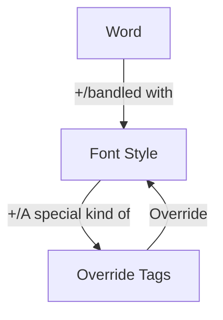
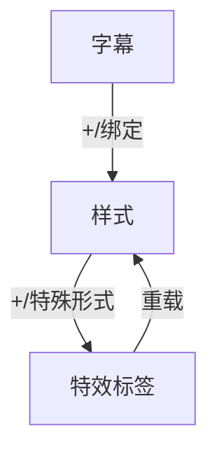

# Aegisub Override Tags | Aegisub特效标签

## Preface 前言

### About Documentation 关于本文档

It's a personal edition of Aegisub Override Tags Documentation. This document is helpful to **amateur** and **experienced**, and also detailed enough for novice to build a comprehension to the tags. Also, if you are an expert, the documents will also have a great help in understanding **why** it is so. So you won't have to spend so many time in debugging or reviewing the official documents everytime you use them.

Before you read, I'd like to state that the tag is highly associated with computer programming, though it's possible to be used without any programming skills. Thus if there's anything caught you stucked, please skip it. Every paragraph is kind of independent that a questioning paragraph won't influence the understanding of other parts.

- If you know nothing about programming and are a completely freshman, I highly recommand you to read [Official Documents](http://docs.aegisub.org/3.2/Main_Page/) and watch some [Tutorial videoes]() first.
- If you are a programmer or **have some basic knowlege in programming**, it will be easy for you to understand. So you only need to take a quick look of this document and use the [API]() once you need to have a look-up.
- If you are an **experienced subtitle producer** with little understanding in programming area, congratulations! This tutorial is tailored for you! Or if you are already an **expert** in Aegisub and want to sharpen your comprehension, this tutorial will also leave a benefit for you.

Thus, though I will include some tables like API as well, the introduction will be with some comprehensive samples and combining skills. So please make sure you already have a basic knowledge of Aegisub and those tags before your reading, which would give you a better experience.

In conclusion, this documentation is focused on theoric comprehension, customized for those who **have basic knowledge of Aegisub**, and interest in **learning more about tags and related programming theories**.

---

这是一篇个人版Aegisub特效标签文档。本文档适合于**爱好者**和**熟练使用者**阅读，并且内含了大量详细说明以便初学者对标签有一个更好的理解。当然，如果你已经非常熟悉Aegisub，这篇文档也能帮你理解(一些写法和现象)**为什么**会是这样。这样你在每次使用时就不必花费大量时间来进行调试和翻阅文档。

在阅读之前，我想先声明特效标签与编程是密切相关的，即便不需要编程基础也能正常使用。因此如果有不理解的部分请直接略过，每段内容相对独立，某一部分的问题不会影响其他内容的理解。

- 如果你是一个完全不了解编程(并且还不太会使用Aegisub)的纯萌新，我强烈推荐你先去阅读[官方文档]()并且观看一些[教学视频]()。
- 如果你是一位程序工程师或者**有一定的编程知识**，那么你会非常快地理解本文档内容。因此你可以快速阅读本文档，之后查阅[API文档]()即可。
- 如果你是一位使用Aegisub非常熟练的**轴Man**，但你对于相关编程知识不甚了解。那么恭喜你！本文档就是为你量身定做的！或者如果你已经是一位**老轴师**并想加深自己对Aegisub的理解，这篇文档一样对你会有帮助。

因此，虽然我也会在其中包含一些API表格，但本文档中会有很多易于理解的实例和组合使用技巧。因此请确保自己对Aegisub有基础的了解以获得更好的阅读体验。

总之，本文档专注于概念理解，适合**对Aegisub有基本了解**，并**对特效标签及相关编程知识感兴趣**的使用者阅读。

### About Notation 关于注记

- This documentation have both Chinese and English version together. Though the explanation styles and words will be different, the concept and theories are the same. Besides, the exteral link will be different (according to the language). It will be divided into two posts after completely finish. There are three major reason for two version: Firstly, it's aimed to be accurate and no ambiguity; Secondly, it's used to help the writer to manage the documenting thread to be clear and perfect, it's also a training of translating skills. Third, it's looking forward to more subtitle amateurs to take a look of it, though whether it's helpful is on you, the readers.
- The document have some graphs using [Mermaid](https://mermaidjs.github.io/) to create, which could be displayed in [Typora](typora.io). And as follows, there's a web picture using [SMMS](sm.ms) as photobed, with the auto-upload service powered by [PicGo](https://picgo.github.io/). Thus, you have no need to read the "rediculous" code blocks, but may help if the picture is not loaded currectly.
- The documentation will mainly use two kinds of notation form as follow
  - `<some-notes>`: e.g.`\fs<font-size>`, please replace the full text including `<>` with the content, like `\fs80`. In contrast with the official documentation, the note will used full natural languages. Though it will be complex comparing to the symbols, but will be more comprehensive.
  - <API-table>: Within every blocks, there will be a api table at the top, with examples and detailed explanation following at most cases. Because of the relationship and contrast will be complex, some significant notes will be also in the tables.

---

- 本文使用中英双语编写，两边给出的解释和说明可能会有略微不同，但整体概念无差异。两侧的相关外部链接也会有差别。待编写完成并进行完善后会拆分为中英两版。写两版的主要理由一是在于为了规范表达消除二义性，二是为了笔者个人进行逻辑梳理和对译训练，三是希望能有海外和更多的字幕制作爱好者能够看到这篇文档，当然是否有帮助要交给各位来评判。

- 本文档配图使用[Mermaid](https://mermaidjs.github.io/)语法编写，Markdown文档自身可以在[Typora](typora.io)等软件内查看。网页版图片会使[SMMS](sm.ms)作为图床，采用[PicGo](https://picgo.github.io/)进行上传部署。因此中间的代码块无需阅读，在无法加载图片的时候可以参考。

- 本文档将主要使用以下两种注记方式
  
  - `<此处填入内容>`：例如`\fs<字体大小>`，在使用时请在`<>`内填入对应的内容，如`\fs80`。与官方文档不同的是，本文档中的内容注记将全部使用自然语言进行表示，因此相较于精简的符号表示会略显繁琐，但更易于理解。
  
  - <API表格>：在每条标签的介绍前均会给出一个API表格用于说明其用法，绝大多数情况下会在后文中有用例及使用说明。由于标签之间的相关和相斥(二选一生效)关系比较复杂，因此重要的描述也会在表格内进行。

## Introduction 绪论

### What is "Override"? 何为"重载"?

Override is a programming terminology, which originally means the sub class rewrite the function in the superclass or interface, so that every instance(object) under the sub class, would prefer to excute the override funtion, instead of the original function declared in the super class. Actually, you don't have to know it so well before your journey in using override tags. In fact, to be simple but not accurate, we can state that each style of every subtitle lines (especailly refers to dialogue), have a 3-layer struture of its presentation in vision.

---

重载是一个编程术语，原意为子类重写了父类或接口中的函数，因此对于子类的实例(对象)，会运行重载后的函数，而非原函数。实际上，你不需要完全理解它。实际上，打个不太准确的比方，我们可以说任何一行中的样式，在显示时存在如下的3层结构。

**注：英文中特效标签被称为*重载标签(Override Tags)*而非*特殊效果标签(Effect Tags)*。**

### Break 空白

### Line Autobreaking Style 自动换行模式

### Interpretation 名词解释

#### Color Notation 颜色注记

A color notation is used to present a RGB color, and in Aegisub, it should be written as `&H<6-digits_color_code>&`. A 6-digit code, which always be with a prefix of `#`, is a standard code to discribe any of the RGB color, which is widely used in web, Photoshop and etc. It is in a format of `RRGGBB` which has **a couple of hexical numbers used for a 8-bit color discription**.

> `RRGGBB`means we use 2-digits of hexical humbers to discribe a kind of color(Red, Green or Blue), then combine them together with each color in the range of 0-255, which actually fit in the range of a 8-bit RGB color (8 digits in binary).
>
> For instance, a color code `F3E109`means that Red = F3(Hex) = 243(Dec), Green = E1(Hex) = 225(Dec), Blue = 09(Hex) = 9(Dec), represent a RGB color of (R,G,B) = (243,225,9), it's gold!

In most case, color notation is capital insensitive, which means `FFACDB`and`ffacdb`are actually the same.

> Note: Though unstandard color code still work, such as `&HFF0000&`(Red) could be written as `&FF0000&`,`FF0000`,`Hff`and even`ff`, I personally not recommand for the abbreviated form because it's difficult for others to tell.
>
> As we can see, Aegisub's parser has some interesting patterns:
>
> - **Weakly Typed Language**
>
>   The tag parser only parse the value it **could** recognize, but not **should** accept. Because of that, it has a weak grammar and allows all kinds of grammar mistakes without runtime error, for it will automatically convert it into nil(NULL/None/Void/Invaild) or 0(No Value/0).
>
>   So if you declared the color like `&H#&`, it will give a color of black, which refers to `0`.
>
> - **Left-Association(Priority)**
>
>   In another word, it will read from left to right, so left code share higher priority than the right. So that's why `FF` equals to `FF0000` instead of `0000FF`. It's the same for inline key words and override tags.
>
>   If you declared twice, it will accept the first(left) one instead of the last(right) one.
>
> - **1-Parameter Inclusity**
>
>   Although it's hard for those programming freshman to comprehend, it's neccessary to tell somthing about [parameter](#Parameter-参数) so that it will be easier for amateurs to remember those **format**. The law is that every tag has only one parameter, or parameter tuple(list). So for those tags that need multi-domains, we need a `()` to make them together as a tuple, otherwise without it.
>   
>   So a simple color tag should be like `\1c&HFF0000&`without`()`, or it will return black as `0`, but the various color need to be declared as `\1vc(&HFF0000&,&HFF0000&,&HFF0000&,&HFF0000&)`.

---

颜色注记是一种表示颜色的方式。在Aegisub中，它被表示为`&H<6位颜色代码>&`。6位颜色代码是一种描述RGB颜色的标准方式，在网页、Photoshop中都有广泛的使用。它的形式是由`红红绿绿蓝蓝`用一对16进制数字用以描述8位色彩。

> `红红绿绿蓝蓝`实际上是我们用2位16进制数表示一种原色(红/绿/蓝)，然后将他们组合起来。每种颜色的范围都是0-255，正好对应8位RGB颜色的范围（256为2的8次幂）。
>
> 例如，一个颜色代码`F3E109`表示红色=F3(十六进制)=243(十进制)，绿色=E1(十六进制)=225(十进制)，蓝色=09(十六进制)=9(十进制)，表示一个(R,G,B)=(243,225,9)的RGB颜色，是金色！

在大多数场景下，颜色注记都是大小写不敏感(不区分大小写)的，这意味着`FFACDB`和`ffacdb`是完全等价的。

> 注意：虽然非标准颜色注记一样能被识别，例如`&HFF0000`(红色)可以被写作`&FF0000&`、`FF0000`、`Hff`甚至是`ff`，但是我个人并不推荐简写形式，这会降低代码可读性。
>
> 因此我们可以看到，Aegisub标签语法有一些有趣的特性：
>
> - **弱类型语法**
>
>   标签语法检测器会识别它**可以**识别的而非**应该**接受的。因此，它是一种包容各种语法错误而不会产生运行错误的弱类型语法。因为它会自动地将无法识别的部分转换为否（空/无/未指定/无效）或者0(空值/值为0)
>
>   `注：关于空/无/未指定(NULL/None/Void)，均为其他编程语言中对于空对象/变量的保留字(描述用的语法)。`
>
>   因此如果你声明`&HF#&`，他会返回一个黑色，也就是`0`值(`000000`)。
>
> - **左结合(优先)性**
>
>   换种方式说，语法分析器会从左向右读，因此左边的优先级比右边更高。这也是为什么`FF`会被认为与`FF0000`等价而不是`0000FF`。对于标签内和标签间均是如此。
>
>   如果你重复声明两种颜色，那么它会取左边(前面)的颜色而非右边(后面)的颜色进行显示。
>
> - **单参数性**
>
>   虽然对于编程新人来说可能难以理解，但是讲一些关于参数的事情还是有必要的。这能让新人更容易记住语法的**格式**。规则是对于任何一个标签只会有一个参数，或一个参数表(参数元组)。因此对于那些需要很多输入的标签，我们需要用一组`()`括起来，使他们形成一个元组，否则不需要。
>
>   所以一个单色标签应该被写作`\1c&HFF0000&`(无括号)，否则就会被转换为`0`(黑色)。但是渐变颜色则需要被声明为 `\1vc(&HFF0000&,&HFF0000&,&HFF0000&,&HFF0000&)`。

#### Library 库

#### Tag Scope 标签作用域

Pa

#### Parameter 参数

- Options
  - Effect Scope 效果作用域
  - Align 对齐方式

- Size
- Color
- Time
- Position
- Angle
- On/Off
- Other Factor

## Elements 元素

### Size 大小

#### Font Size 字体大小

| Code               | `\fs<font_size>`                    |
| ------------------ | ----------------------------------- |
| Discription        | Inline modifier of font's dot size. |
| Fx Scope           | Syllable                            |
| Library Affiliated | VSFilter                            |

The dot size contributes to the frame size. For instance, a font in size of 80 in 1080P video script could be as large as the one in size of 60 whose script is in 720P size. Besides, the size is limited which means it could not be extremely large.

#### Element Size 元素大小

| Code               | `\fsc<size（%）>`      |
| ------------------ | ---------------------- |
| Discription        | Scale of line element. |
| Fx Scope           | Syllable               |
| Library Affiliated | VSFilterMod            |

### Color 颜色

If you forget about `color_notation`, you can return to paragraph [Color Notation](#Color-Notation-颜色注记) before read.

#### Simple Color 单色

| Code               | `\<scope>c<color>`                     |
| ------------------ | -------------------------------------- |
| Discription        | Fill with color in a particular scope. |
| Fx Scope           | Syllable                               |
| Library Affiliated | VSFilterMod                            |

#### Various Color 渐变色

| Code               | `\<scope>vc<left-top-color,right-top-Color,left-bottom-Color,right-bottom-Color>` |
| ------------------ | ------------------------------------------------------------ |
| Discription        | Fill with 4-angle-controlled linear gradient color in a particular scope. |
| Fx Scope           | Syllable                                                     |
| Library Affiliated | VSFilterMod                                                  |

### Font Style 字体样式

#### Border Width 描边宽度

| Code               | `\bord<width>`            |
| ------------------ | ------------------------- |
| Discription        | Border width of the font. |
| Fx Scope           | Syllable                  |
| Library Affiliated | VSFilter                  |

#### Shadow Distance 阴影距离

| Code               | `\shad<distance>`                        |
| ------------------ | ---------------------------------------- |
| Discription        | The distance(size) of the font's shadow. |
| Fx Scope           | Syllable                                 |
| Library Affiliated | VSFilter                                 |

#### Blur Edge 模糊边缘
##### Simple Blur 简单模糊
| Code               | `\b<on/off>`              |
| ------------------ | ------------------------- |
| Discription        | With/Without blur effect. |
| Fx Scope           | Syllable                  |
| Library Affiliated | VSFilter                  |

##### Gaussian Blur 高斯模糊
| Code               | `\be<on/off>`             |
| ------------------ | ------------------------- |
| Discription        | With/Without blur effect. |
| Fx Scope           | Syllable                  |
| Library Affiliated | VSFilter                  |

#### Spacing 字符间距

- code: ``

#### Font Family 字体

| Code               | `\be<on/off>`             |
| ------------------ | ------------------------- |
| Discription        | With/Without blur effect. |
| Fx Scope           | Syllable                  |
| Library Affiliated | VSFilter                  |

-code: `\fn<font-family name>`

## Shape(AssDraw) 形状(绘图)

### Draw Activation 开启绘图
- code: `\p<0/1>`

  | Code               | `\be<on/off>`             |
  | ------------------ | ------------------------- |
  | Discription        | With/Without blur effect. |
  | Fx Scope           | Syllable                  |
  | Library Affiliated | VSFilter                  |
### ASSDraw Code 绘图代码

## Attribute 属性

### Alpha 不透明度

| Code               | `\alpha<color>`           |
| ------------------ | ------------------------- |
| Discription        | With/Without blur effect. |
| Fx Scope           | Syllable                  |
| Library Affiliated | VSFilter                  |

### Line Alignment 对齐方式
- | Code               | `\an<align>`              |
  | ------------------ | ------------------------- |
  | Discription        | With/Without blur effect. |
  | Fx Scope           | Syllable                  |
  | Library Affiliated | VSFilter                  |
### Rotation 旋转
#### Common Rotation (Z-axis Rotation) 平面旋转(Z轴旋转)
- code: `\frz<angle>`

- | Code               | `\frz<angle>`             |
  | ------------------ | ------------------------- |
  | Discription        | With/Without blur effect. |
  | Fx Scope           | Syllable                  |
  | Library Affiliated | VSFilter                  |

#### X-axis Rotation (Fake 3D) X轴旋转(伪3D)
- code: `\frx<angle>`

- | Code               | `\frx<angle>`             |
  | ------------------ | ------------------------- |
  | Discription        | With/Without blur effect. |
  | Fx Scope           | Syllable                  |
  | Library Affiliated | VSFilter                  |

#### Y-axis Rotation (Fake 3D) Y轴旋转(伪3D)
- code: `\fry<angle>`

- | Code               | `\fry<angle>`             |
  | ------------------ | ------------------------- |
  | Discription        | With/Without blur effect. |
  | Fx Scope           | Syllable                  |
  | Library Affiliated | VSFilter                  |

### Mask 遮罩

#### Clip 矩形遮罩

| Code               | `\clip(<left-top-point-postion>,<right-bottom-point-postion>)` |
| ------------------ | ------------------------------------------------------------ |
| Discription        | With/Without blur effect.                                    |
| Fx Scope           | Syllable                                                     |
| Library Affiliated | VSFilter                                                     |

#### Bezier Clip 贝塞尔遮罩

| Code               | `\be<on/off>`             |
| ------------------ | ------------------------- |
| Discription        | With/Without blur effect. |
| Fx Scope           | Syllable                  |
| Library Affiliated | VSFilter                  |

### Position 位置

| Code               | `\pos(<position>)`        |
| ------------------ | ------------------------- |
| Discription        | With/Without blur effect. |
| Fx Scope           | Syllable                  |
| Library Affiliated | VSFilter                  |

### Style Reset 重置样式

| Code               | `\r`                      |
| ------------------ | ------------------------- |
| Discription        | With/Without blur effect. |
| Fx Scope           | Syllable                  |
| Library Affiliated | VSFilter                  |

## Motion 动画

### Keyframe Animation 关键帧动画

| Code               | `\t(<start-timestamp(frame)>,<end-timestamp(frame)>,<corresponding-effects>)` |
| ------------------ | ------------------------------------------------------------ |
| Discription        | With/Without blur effect.                                    |
| Fx Scope           | Syllable                                                     |
| Library Affiliated | VSFilter                                                     |

### Fade(Fade-in&out) 渐变(淡入淡出)

#### Simple Fade 简单渐变
- code: `\fad(intime_range,outtime_range)`

- | Code               | `\fad(<fade-in-animation-length>,<fade-out-animation-length>)` |
  | ------------------ | ------------------------------------------------------------ |
  | Discription        | Simple Fade-in and Fade-out Effect.                          |
  | Fx Scope           | Line                                                         |
  | Library Affiliated | VSFilter                                                     |

#### Complex Fade 复杂渐变
- code: `\fade(alpha_at_first, alpha_in_the_middle, alpha_before_end, timestamp_at_the_tail_of_*first*,time_at_the_head_of_the_*middle*,time_at_the_tail_of_the_*middle*,time_at_the_head_of_*end*)`

- | Code               | `\be<on/off>`             |
  | ------------------ | ------------------------- |
  | Discription        | With/Without blur effect. |
  | Fx Scope           | Syllable                  |
  | Library Affiliated | VSFilter                  |
### Movement 移动

#### Move-in-line

| Code               | `\be<on/off>`             |
| ------------------ | ------------------------- |
| Discription        | With/Without blur effect. |
| Fx Scope           | Syllable                  |
| Library Affiliated | VSFilter                  |

#### Complex Movement

| Code               | `\be<on/off>`             |
| ------------------ | ------------------------- |
| Discription        | With/Without blur effect. |
| Fx Scope           | Syllable                  |
| Library Affiliated | VSFilter                  |

## Karaoke 卡拉OK

### Key Time

| Code               | `\be<on/off>`             |
| ------------------ | ------------------------- |
| Discription        | With/Without blur effect. |
| Fx Scope           | Syllable                  |
| Library Affiliated | VSFilter                  |

### Key with Fade

| Code               | `\be<on/off>`             |
| ------------------ | ------------------------- |
| Discription        | With/Without blur effect. |
| Fx Scope           | Syllable                  |
| Library Affiliated | VSFilter                  |

### Conclusion

| Code               | `\be<on/off>`             |
| ------------------ | ------------------------- |
| Discription        | With/Without blur effect. |
| Fx Scope           | Syllable                  |
| Library Affiliated | VSFilter                  |